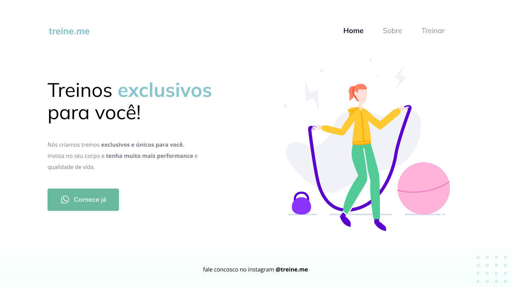

<h1 align="center"> Treine me </h1>

Programa exclusivo, promovido pela trilha Explorer da Rocketseat para ensino de tecnologias WEB. 

  <a href="#-tecnologias">Tecnologias</a>&nbsp;&nbsp;&nbsp;|&nbsp;&nbsp;&nbsp;
  <a href="#-projeto">Projeto</a>&nbsp;&nbsp;&nbsp;|&nbsp;&nbsp;&nbsp;
  <a href="#-layout">Layout</a>&nbsp;&nbsp;&nbsp;|&nbsp;&nbsp;&nbsp;
  <a href="#memo-licença">Licença</a>

  

 

  

## 🚀 Tecnologias

Esse projeto foi desenvolvido com as seguintes tecnologias:

- HTML e CSS
- Git e Github
- Figma

## 💻 Projeto

O TreineMe é uma aplicação web simulando uma consultoria de personal trainer online, que monta treinos exclusivos e personalizados para alunos que desejam aumentar sua performance e, em paralelo, melhorar sua qualidade de vida. 

Programa tem por finalidade reforçar os conceitos básicos de HTML e CSS, ratificando a importância da correta utilização de tags semânticas, utilizando a aplicação de botões interativos, e corroborando a necessidade de melhorias na acessibilidade e refatoração.   
Além disso, destaca-se a relevância do aprendizado da ferramenta FIGMA, aliada importante nas tarefas propostas pelo projeto.

- [Acesse o projeto finalizado, online]

## 🔖 Layout

Você pode visualizar o layout do projeto através [DESSE LINK](https://www.figma.com/file/UlOPOIrdrDQhszzx3RepSD/Explorer---Projeto-02-(Copy)?node-id=0%3A1&mode=dev). É necessário ter conta no [Figma](https://figma.com) para acessá-lo.

## :memo: Licença

Esse projeto está sob a licença MIT.

---

Feito com ♥ by Bernardo Sá :wave: [Participe da comunidade da Rocketseat!](https://discord.gg/rocketseat)